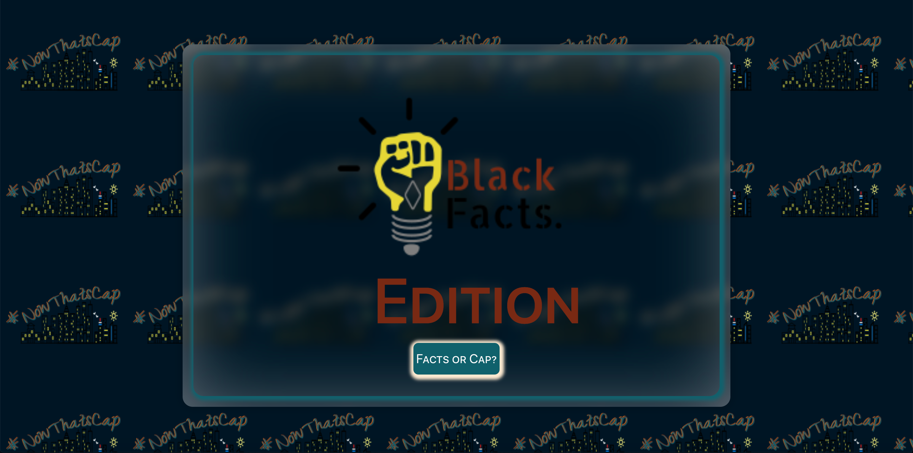
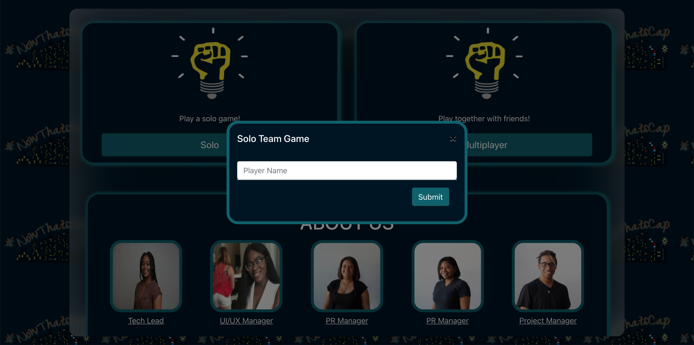
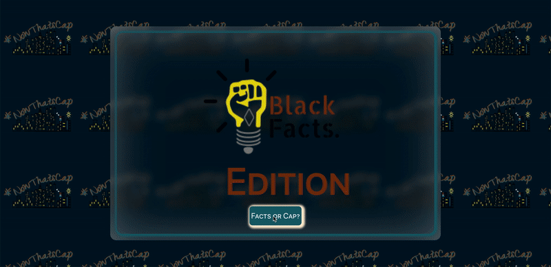

# #NowThatsCap
## [#NowThatsCap: Beta App](https://nowthatscap.netlify.app/ '#NowThatsCap Beta App')
### Black History Month "Just Build" One Week Hackathon

### #NowThatsCap, a Frontend Web Application inspired by Black New York City culture, is the easy and breezy solution to accessing all the knowledge you already know, the things you need to know and the things you wouldn’t want to know but are still equally as important as to not allow the world to re-write history. Africa is the motherland and black culture is the blueprint and it was our mission to showcase that.

### With the amount of overwhelming events that have occured in the past 2 to 3 years, we know how daunting learning new and unbiased information can be so we wanted to make sure it would be a good time.

### #NowThatsCap: Landing

### #NowThatsCap: Enter Name or Solo Team name 

### #NowThatsCap: Select From Various Categories

### #NowThatsCap: Everyone's a Winner 

This app was built with React.
Best viewed on Web [Beta Mode: We plan on continuing to build.]

## Features
- Users can create solo team or player 
- Select from 6 categories to start game play 
- Users are able to select from 25 questions in a race to beat the game timer
- App keeps track of the player's score and once timer reaches 0, player is sent to the results page 

## Future Implementations
- Create various editions to the game and add more categories 
- Allow for Multiplayers/Teams 
- Chatrooms for various teams and buzzer 
- User accounts and gloabl app score leaderboard  
- Age validation as some categories may be triggering 
- "Did You Know?" section for users who just want to learn rather than playing the game 

# Technical Milestones
- Creating Game Timer
- Implementing Redux Toolkit 

## Deployment: Netlify
